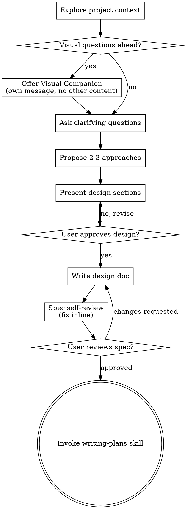

# 将想法头脑风暴为设计

通过自然的协作对话，帮助将想法转化为完整的设计和规格说明。

首先了解当前项目上下文，然后逐个提问以完善想法。一旦你理解了要构建什么，就展示设计并获得用户批准。

<HARD-GATE>
在展示设计并获得用户批准之前，不要调用任何实现技能、编写任何代码、搭建任何项目，或采取任何实现操作。这适用于**每个**项目，无论看起来多简单。
</HARD-GATE>

## 反模式：「这个太简单了，不需要设计」

每个项目都要经过这个过程。一个待办列表、一个单功能工具、一个配置变更——全部都要。「简单」的项目正是未经审视的假设造成最多浪费的地方。设计可以很短（对于真正简单的项目几句话即可），但你**必须**展示设计并获得批准。

## 检查清单

你必须为以下每一项创建任务并按顺序完成：

1. **探索项目上下文** — 检查文件、文档、最近的提交
2. **提供视觉伴侣**（如果主题涉及视觉问题）— 这是独立的一条消息，不要与澄清性问题合并。参见下方的视觉伴侣部分。
3. **询问澄清性问题** — 一次一个，了解目的/约束/成功标准
4. **提出 2-3 种方案** — 包含权衡和你的推荐
5. **展示设计** — 按各部分复杂度适当缩放，每部分展示后获得用户批准
6. **编写设计文档** — 保存到 `docs/superpowers/specs/YYYY-MM-DD-<topic>-design.md` 并提交
7. **规格自审** — 快速内联检查占位符、矛盾、歧义、范围（见下方）
8. **用户审阅书面规格** — 在继续之前请用户审阅规格文件
9. **转换到实现** — 调用 writing-plans 技能创建实现计划

## 流程

**最终状态是调用 writing-plans。** 不要调用 frontend-design、mcp-builder 或任何其他实现技能。在 brainstorming 之后你调用的**唯一**技能是 writing-plans。

## 过程

**理解想法：**

- 首先检查当前项目状态（文件、文档、最近的提交）
- 在询问详细问题之前，评估范围：如果请求描述了多个独立的子系统（例如「构建一个包含聊天、文件存储、计费和分析的平台」），立即指出这一点。不要在需要先分解的项目的细节上浪费问题。
- 如果项目对于单一规格来说过于庞大，帮助用户将其分解为子项目：独立的组成部分是什么，它们之间如何关联，应该按什么顺序构建？然后按正常的设计流程对第一个子项目进行头脑风暴。每个子项目都遵循自己的 规格 → 计划 → 实现 循环。
- 对于适当范围的项目，逐个提问以完善想法
- 尽可能优先使用选择题，但开放式问题也可以
- 每条消息只包含一个问题——如果某个主题需要更多探索，将其拆分为多个问题
- 专注于理解：目的、约束、成功标准

**探索方案：**

- 提出 2-3 种不同方案，并说明各自的权衡
- 以对话方式展示选项，附上你的推荐和理由
- 首先介绍你推荐的选项，并解释原因

**展示设计：**

- 一旦你确信理解了要构建的内容，就展示设计
- 按各部分复杂度适当缩放：如果直截了当只需几句话，如果需要细致说明则可长达 200-300 字
- 每部分展示后询问是否到目前为止看起来没问题
- 涵盖：架构、组件、数据流、错误处理、测试
- 如果某些内容不合理，随时准备回溯并澄清

**为隔离和清晰而设计：**

- 将系统分解为更小的单元，每个单元有一个明确的目的，通过定义良好的接口进行通信，并且可以独立理解和测试
- 对于每个单元，你应该能够回答：它做什么，如何使用它，它依赖什么？
- 有人能在不阅读内部实现的情况下理解一个单元的功能吗？你能在不变更消费者的前提下更改内部实现吗？如果不能，边界需要改进。
- 更小、边界清晰的单元对你来说也更容易处理——你在能一次性放入上下文的代码上推理得更好，当文件专注于单一职责时你的编辑也更可靠。当文件变得很大时，这通常是一个信号，表明它做了太多事情。

**在现有代码库中工作：**

- 在提出变更之前探索当前结构。遵循现有的模式。
- 当现有代码存在影响当前工作的问题时（例如文件过大、边界不清、职责混乱），将有针对性的改进纳入设计中——就像一个优秀的开发者在改进他们参与工作的代码一样。
- 不要提出无关的重构。专注于对当前目标有益的事情。

## 设计之后

**文档化：**

- 将验证过的设计（规格）写入 `docs/superpowers/specs/YYYY-MM-DD-<topic>-design.md`
  - （用户对规格存放位置的偏好会覆盖此默认值）
- 如果可用，使用 elements-of-style:writing-clearly-and-concisely 技能
- 将设计文档提交到 git

**规格自审：**
写完规格文档后，用全新的眼光审视它：

1. **占位符扫描：** 是否有「TBD」、「TODO」、不完整的部分或模糊的需求？修复它们。
2. **内部一致性：** 各部分之间是否有矛盾？架构是否与功能描述匹配？
3. **范围检查：** 是否足够聚焦于单一实现计划，还是需要进一步分解？
4. **歧义检查：** 是否有任何需求可能被以两种不同的方式解读？如果有，选择一种并明确说明。

内联修复所有问题。无需再次审查——修复后继续前进。

**用户审阅关卡：**
在规格审查循环通过后，在继续之前请用户审阅书面规格：

> 「规格已写入并提交到 `<path>`。请审阅，如果在我们开始编写实现计划之前你想做任何修改，请告诉我。」

等待用户的回复。如果他们请求修改，就进行修改并重新运行规格审查循环。只有在用户批准后才继续。

**实现：**

- 调用 writing-plans 技能创建详细的实现计划
- 不要调用任何其他技能。writing-plans 是下一步。

## 关键原则

- **一次一个问题** — 不要用多个问题压倒对方
- **优先选择题** — 可能时比开放式问题更容易回答
- **无情地践行 YAGNI** — 从所有设计中移除不必要的功能
- **探索替代方案** — 在确定之前始终提出 2-3 种方案
- **增量验证** — 展示设计，获得批准后再继续
- **保持灵活** — 当某些内容不合理时回头澄清

## 视觉伴侣

一个基于浏览器的伴侣工具，用于在头脑风暴期间展示原型、图表和视觉选项。作为一个工具提供——不是一种模式。接受伴侣意味着它可用于那些能从视觉处理中受益的问题；这**不**意味着每个问题都通过浏览器进行。

**提供伴侣：** 当你预计接下来的问题会涉及视觉内容（原型、布局、图表）时，征求一次同意：
> 「我们正在做的一些事情，如果我能在网页浏览器中展示给你看，可能会更容易解释。我可以在过程中制作原型、图表、对比图和其他视觉内容。这个功能还比较新，可能会消耗较多 token。想试试吗？（需要打开本地 URL）」

**这个提议必须是一条独立的消息。** 不要将其与澄清性问题、上下文摘要或任何其他内容合并。这条消息应该**只**包含上述提议，没有其他内容。在继续之前等待用户的回复。如果他们拒绝，就用纯文本进行头脑风暴。

**逐问题决策：** 即使用户接受了，对**每个问题**决定是使用浏览器还是终端。测试标准：**用户通过看到它比读到它能更好地理解这个内容吗？**

- **使用浏览器** 处理**视觉**内容——原型、线框图、布局比较、架构图、并排的视觉设计
- **使用终端** 处理文本内容——需求问题、概念选择、权衡列表、A/B/C/D 文本选项、范围决策

关于 UI 主题的问题不一定自动是视觉问题。「在这个上下文中，个性化意味着什么？」是一个概念性问题——使用终端。「哪个向导布局更好？」是一个视觉问题——使用浏览器。

如果他们同意使用伴侣，在继续之前阅读详细指南：
`skills/brainstorming/visual-companion.md`
