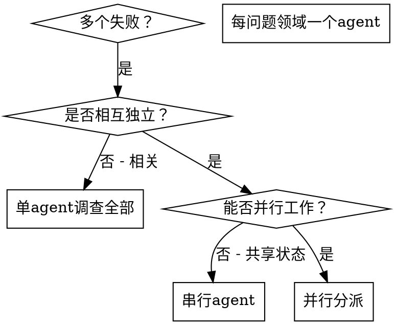

# 并行调度subagent

## 概述

将任务委派给具有隔离上下文的专用agent。通过精确设计其指令和上下文，确保它们保持专注并成功完成任务。它们绝不应继承当前会话的上下文或历史——你需要精确构建它们所需的全部内容。这也为你自己的协调工作保留了上下文空间。

当你面临多个不相关的失败时（不同测试文件、不同子系统、不同 bug），逐个调查会浪费大量时间。每个调查都是独立的，可以并行进行。

**核心原则：** 每个独立的问题领域分派一个agent。让它们并发工作。

## 何时使用



**适用场景：**
- 3 个以上测试文件失败且根因不同
- 多个子系统独立损坏
- 每个问题无需其他问题的上下文即可理解
- 调查之间无共享状态

**不适用场景：**
- 失败相互关联（修复一个可能修复其他）
- 需要理解完整的系统状态
- agent之间会相互干扰

## 模式

### 1. 识别独立领域

按问题类型对失败进行分组：
- 文件 A 测试：工具审批流程（Tool Approval Flow）
- 文件 B 测试：批量完成行为（Batch Completion Behavior）
- 文件 C 测试：中止功能（Abort Functionality）

每个领域是独立的——修复工具审批不会影响中止测试。

### 2. 创建聚焦的agent任务

每个agent获得：
- **明确范围：** 一个测试文件或子系统
- **清晰目标：** 使这些测试通过
- **约束条件：** 不要修改其他代码
- **预期输出：** 发现和修复内容的摘要

### 3. 并行分派

```typescript
// 在 Claude Code / AI 环境中
Task("修复 agent-tool-abort.test.ts 的失败测试")
Task("修复 batch-completion-behavior.test.ts 的失败测试")
Task("修复 tool-approval-race-conditions.test.ts 的失败测试")
// 三者并发运行
```

### 4. 审查与整合

agent返回后：
- 阅读每个摘要
- 验证修复之间无冲突
- 运行完整测试套件
- 整合所有变更

## agent提示词结构

好的agent提示词应该是：
1. **聚焦**——一个明确的问题领域
2. **自包含**——理解问题所需的所有上下文
3. **明确输出要求**——agent应返回什么？

```markdown
修复 src/agents/agent-tool-abort.test.ts 中的 3 个失败测试：

1. "should abort tool with partial output capture" —— 期望消息中包含 'interrupted at'
2. "should handle mixed completed and aborted tools" —— fast tool 被中止而非完成
3. "should properly track pendingToolCount" —— 期望 3 个结果但得到 0

这些是时序/race condition 问题。你的任务：

1. 阅读测试文件，理解每个测试验证的内容
2. 识别根因——是时序问题还是实际 bug？
3. 通过以下方式修复：
   - 将任意超时替换为基于事件的等待
   - 如果发现中止实现中的 bug，则修复
   - 如果测试的是已变更行为，则调整测试期望

不要只是增加超时时间——找到真正的问题。

返回：发现和修复内容的摘要。
```

## 常见错误

**❌ 范围过宽：** "修复所有测试"——agent会迷失方向
**✅ 范围明确：** "修复 agent-tool-abort.test.ts"——聚焦的范围

**❌ 无上下文：** "修复race condition"——agent不知道在哪里
**✅ 提供上下文：** 粘贴错误消息和测试名称

**❌ 无约束：** agent可能重构一切
**✅ 有约束：** "不要修改生产代码"或"只修复测试"

**❌ 输出模糊：** "修好它"——你不知道改了什么
**✅ 具体要求：** "返回根因和变更的摘要"

## 何时不应使用

**相关失败：** 修复一个可能修复其他——先一起调查
**需要完整上下文：** 理解需要查看整个系统
**探索性调试：** 你还不知道哪里出了问题
**共享状态：** agent会相互干扰（编辑相同文件、使用相同资源）

## 会话实战示例

**场景：** 一次重大重构后，3 个文件中共 6 个测试失败

**失败项：**
- agent-tool-abort.test.ts：3 个失败（时序问题）
- batch-completion-behavior.test.ts：2 个失败（工具未执行）
- tool-approval-race-conditions.test.ts：1 个失败（执行计数 = 0）

**决策：** 独立领域——中止逻辑与批量完成与race condition互不相关

**分派：**
```
agent 1 → 修复 agent-tool-abort.test.ts
agent 2 → 修复 batch-completion-behavior.test.ts
agent 3 → 修复 tool-approval-race-conditions.test.ts
```

**结果：**
- agent 1：将超时替换为基于事件的等待
- agent 2：修复了事件结构 bug（threadId 位置错误）
- agent 3：添加了对异步工具执行完成的等待

**整合：** 所有修复独立、无冲突、全测试通过

**节省时间：** 3 个问题并行解决，而非串行

## 核心优势

1. **并行化**——多项调查同时进行
2. **聚焦**——每个agent范围狭窄，需要跟踪的上下文更少
3. **独立性**——agent之间互不干扰
4. **速度**——在解决 1 个问题的时间内解决 3 个问题

## 验证

agent返回后：
1. **审查每个摘要**——理解变更内容
2. **检查冲突**——agent是否编辑了相同代码？
3. **运行完整套件**——验证所有修复能协同工作
4. **抽查**——agent可能犯系统性错误

## 实际效果

来自调试会话（2025-10-03）：
- 跨 3 个文件 6 个失败
- 并行分派 3 个agent
- 所有调查并发完成
- 所有修复成功整合
- agent变更之间零冲突
