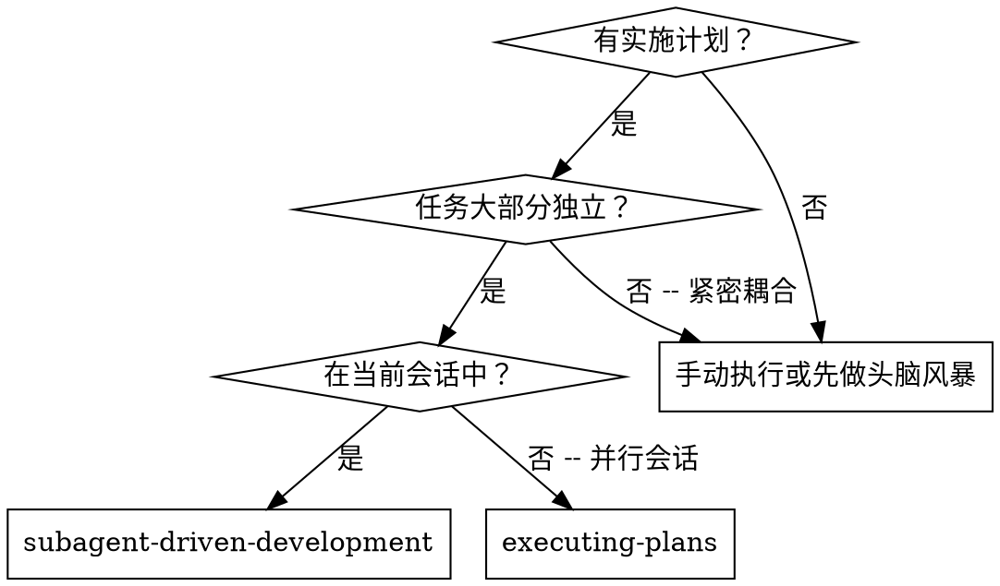
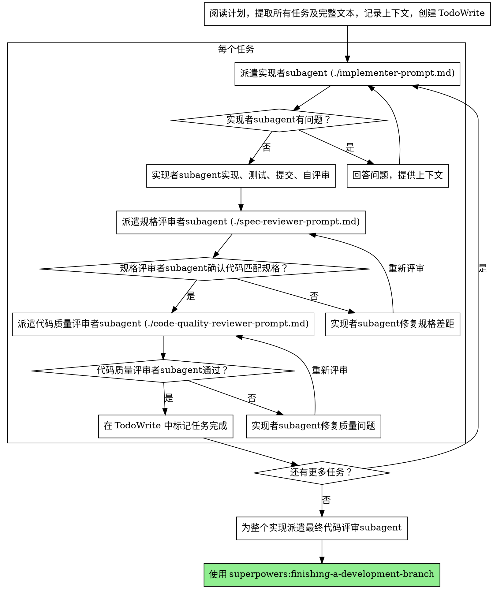

# subagent驱动开发（Subagent-Driven Development）

执行计划：为每个任务派遣新的subagent，每个任务后进行两阶段评审：先做规格合规（spec compliance）评审，再做代码质量评审。

**为什么用subagent：** 你将任务委派给具有隔离上下文的专门agent。通过精确构造它们的指令和上下文，确保它们保持专注并成功完成任务。它们不应继承你的会话上下文或历史——你构建的正是它们需要的。这也为你保留了自己的上下文，以便进行协调工作。

**核心原则：** 每个任务使用新subagent + 两阶段评审（先规格后质量）= 高质量、快速迭代

**持续执行：** 不要在任务之间暂停向你的人类伙伴汇报。不中断地执行计划中的所有任务。唯一停止的理由是：你无法解决的 BLOCKED 状态、真正阻碍进展的歧义、或所有任务已完成。"我应该继续吗？"这样的提示和进度摘要浪费他们的时间——他们让你执行计划，那就执行它。

## 何时使用



**vs. 执行计划（Executing Plans，并行会话）：**
- 同一会话（无需上下文切换）
- 每个任务使用新subagent（无上下文污染）
- 每个任务后两阶段评审：先规格合规，再代码质量
- 更快迭代（任务之间无需人工介入）

## 流程



## 模型选择

使用能处理每个角色的最弱模型，以节省成本并提高速度。

**机械实现任务**（独立函数、清晰的规格、1-2 个文件）：使用快速廉价的模型。当计划明确时，大多数实现任务是机械性的。

**集成和判断任务**（多文件协调、模式匹配、调试）：使用标准模型。

**架构、设计和评审任务**：使用能力最强的模型。

**任务复杂度信号：**
- 涉及 1-2 个文件且有完整规格 → 廉价模型
- 涉及多个文件且有集成问题 → 标准模型
- 需要设计判断或广泛的代码库理解 → 能力最强的模型

## 处理实现者状态

实现者subagent报告四种状态之一。妥善处理每种状态：

**DONE：** 进入规格合规评审。

**DONE_WITH_CONCERNS：** 实现者完成了工作但标记了疑虑。在继续之前阅读疑虑。如果疑虑涉及正确性或范围，在评审之前解决它们。如果只是观察（例如"这个文件越来越大了"），记录下来并继续评审。

**NEEDS_CONTEXT：** 实现者需要未提供的信息。提供缺失的上下文并重新派遣。

**BLOCKED：** 实现者无法完成任务。评估阻塞原因：
1. 如果是上下文问题，提供更多上下文并使用相同模型重新派遣
2. 如果任务需要更多推理，使用更强能力的模型重新派遣
3. 如果任务太大，将其拆分为更小的部分
4. 如果计划本身有误，上报给你的人类伙伴

**绝不**忽略上报或不做任何改变就强制相同模型重试。如果实现者说卡住了，一定需要改变什么。

## 提示模板

- `./implementer-prompt.md` —— 派遣实现者subagent
- `./spec-reviewer-prompt.md` —— 派遣规格合规评审者subagent
- `./code-quality-reviewer-prompt.md` —— 派遣代码质量评审者subagent

## 示例工作流

```
你: 我正在使用subagent驱动开发来执行这个计划。

[阅读一次计划文件: docs/superpowers/plans/feature-plan.md]
[提取所有 5 个任务及完整文本和上下文]
[创建包含所有任务的 TodoWrite]

Task 1: Hook 安装脚本

[获取 Task 1 文本和上下文（已提取）]
[以完整任务文本 + 上下文派遣实现subagent]

实现者: "开始之前——Hook 应该安装在用户级别还是系统级别？"

你: "用户级别 (~/.config/superpowers/hooks/)"

实现者: "明白了。现在实施……"
[稍后] 实现者:
  - 实现了 install-hook 命令
  - 添加了测试，5/5 通过
  - 自评审: 发现遗漏了 --force 标志，已添加
  - 已提交

[派遣规格合规评审者]
规格评审者: ✅ 符合规格——满足所有需求，没有多余内容

[获取 git SHA，派遣代码质量评审者]
代码评审者: 优点: 测试覆盖好，代码干净。问题: 无。通过。

[标记 Task 1 完成]

Task 2: 恢复模式

[获取 Task 2 文本和上下文（已提取）]
[以完整任务文本 + 上下文派遣实现subagent]

实现者: [没有问题，继续]
实现者:
  - 添加了 verify/repair 模式
  - 8/8 测试通过
  - 自评审: 一切正常
  - 已提交

[派遣规格合规评审者]
规格评审者: ❌ 问题:
  - 缺失: 进度报告（规格要求 "每 100 项报告一次"）
  - 多余: 添加了 --json 标志（未被请求）

[实现者修复问题]
实现者: 移除了 --json 标志，添加了进度报告

[规格评审者再次评审]
规格评审者: ✅ 现在符合规格

[派遣代码质量评审者]
代码评审者: 优点: 扎实。问题 (Important): 魔法数字 (100)

[实现者修复]
实现者: 提取了 PROGRESS_INTERVAL 常量

[代码评审者再次评审]
代码评审者: ✅ 通过

[标记 Task 2 完成]

...

[所有任务完成后]
[派遣最终代码评审者]
最终评审者: 满足所有需求，可以合并

完成！
```

## 优势

**vs. 手动执行：**
- subagent自然地遵循 TDD
- 每个任务的上下文是新鲜的（不会混淆）
- 并行安全（subagent不会互相干扰）
- subagent可以提问（开始工作前和工作过程中）

**vs. 执行计划（Executing Plans）：**
- 同一会话（无需交接）
- 持续进展（无需等待）
- 自动的评审检查点

**效率提升：**
- 无需读取文件的开销（控制器提供完整文本）
- 控制器精确策划所需的上下文
- subagent从开始就获得完整信息
- 问题在工作开始前就提出（而非之后）

**质量关卡：**
- 自评审在交接前捕获问题
- 两阶段评审：规格合规，然后代码质量
- 评审循环确保修复确实有效
- 规格合规防止过度构建或构建不足
- 代码质量确保实现构建良好

**成本：**
- 更多subagent调用（每个任务：实现者 + 2 个评审者）
- 控制器做更多准备工作（预先提取所有任务）
- 评审循环增加迭代次数
- 但早期捕获问题（比后期调试更便宜）

## 红旗信号 (Red Flags)

**绝不：**
- 在没有明确用户同意的情况下在 main/master 分支上开始实现
- 跳过评审（规格合规或代码质量）
- 在问题未修复时继续
- 并行派遣多个实现subagent（会产生冲突）
- 让subagent读取计划文件（应提供完整文本）
- 跳过场景设置上下文（subagent需要了解任务的整体定位）
- 忽略subagent的问题（在让它们继续之前回答）
- 在规格合规上接受"差不多"（规格评审者发现了问题 = 没有完成）
- 跳过评审循环（评审者发现问题 = 实现者修复 = 再次评审）
- 让实现者自评审替代实际评审（两者都需要）
- **在规格合规通过之前开始代码质量评审**（顺序错误）
- 在任一评审有未解决问题时进入下一个任务

**如果subagent提问：**
- 清晰完整地回答
- 如有需要，提供额外上下文
- 不要催促它们进入实现

**如果评审者发现问题：**
- 实现者（同一subagent）修复问题
- 评审者再次评审
- 重复直到通过
- 不要跳过重新评审

**如果subagent任务失败：**
- 派遣修复subagent，给出具体指令
- 不要尝试手动修复（会造成上下文污染）

## 集成

**必需的工作流技能：**
- **superpowers:using-git-worktrees** —— 确保隔离工作空间（创建或验证现有的）
- **superpowers:writing-plans** —— 创建此技能执行的计划
- **superpowers:requesting-code-review** —— 评审者subagent的代码评审模板
- **superpowers:finishing-a-development-branch** —— 所有任务完成后完成开发

**subagent应使用：**
- **superpowers:test-driven-development** —— subagent为每个任务遵循 TDD

**替代工作流：**
- **superpowers:executing-plans** —— 用于并行会话而非同一会话执行
