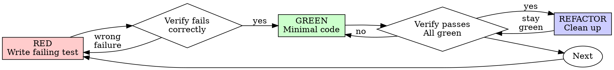

# 测试驱动开发 (Test-Driven Development)

## 概述

先写测试。看着它失败。写最少的代码让它通过。

**核心原则：** 如果你没有看到测试失败，你就不知道它是否测试了正确的东西。

**违反规则的字面要求，就是违反规则的精神。**

## 何时使用

**始终：**
- 新功能
- Bug 修复
- 重构
- 行为变更

**例外（询问你的人类伙伴 (your human partner)）：**
- 一次性原型
- 生成的代码
- 配置文件

在想"就这一次跳过 TDD"？停下来。那是在合理化。

## 铁律

```
没有先失败的测试，就没有生产代码
```

在测试之前写代码？删除它。重新开始。

**没有例外：**
- 不要保留它作为"参考"
- 不要在写测试时"适配"它
- 不要看它
- 删除意味着删除

从头开始基于测试实现。就这么定了。

## 红-绿-重构



### RED - 写失败测试

写一个展示应该发生什么的最简测试。

<Good>
```typescript
test('retries failed operations 3 times', async () => {
  let attempts = 0;
  const operation = () => {
    attempts++;
    if (attempts < 3) throw new Error('fail');
    return 'success';
  };

  const result = await retryOperation(operation);

  expect(result).toBe('success');
  expect(attempts).toBe(3);
});
```
名称清晰，测试真实行为，一次只测一件事
</Good>

<Bad>
```typescript
test('retry works', async () => {
  const mock = jest.fn()
    .mockRejectedValueOnce(new Error())
    .mockRejectedValueOnce(new Error())
    .mockResolvedValueOnce('success');
  await retryOperation(mock);
  expect(mock).toHaveBeenCalledTimes(3);
});
```
名称模糊，测试的是 mock 而非代码
</Bad>

**要求：**
- 一个行为
- 清晰的名称
- 真实代码（除非不可避免，否则不用 mock）

### 验证 RED - 看着它失败

**强制性的。永远不跳过。**

```bash
npm test path/to/test.test.ts
```

确认：
- 测试失败（不是错误 (errors)）
- 失败消息符合预期
- 失败是因为功能缺失（不是拼写错误）

**测试通过了？** 你在测试已有行为。修复测试。

**测试报错 (errors)？** 修复错误，重新运行直到它正确地失败。

### GREEN - 最简代码

写最简单的代码让测试通过。

<Good>
```typescript
async function retryOperation<T>(fn: () => Promise<T>): Promise<T> {
  for (let i = 0; i < 3; i++) {
    try {
      return await fn();
    } catch (e) {
      if (i === 2) throw e;
    }
  }
  throw new Error('unreachable');
}
```
刚好足够通过测试
</Good>

<Bad>
```typescript
async function retryOperation<T>(
  fn: () => Promise<T>,
  options?: {
    maxRetries?: number;
    backoff?: 'linear' | 'exponential';
    onRetry?: (attempt: number) => void;
  }
): Promise<T> {
  // YAGNI
}
```
过度设计
</Bad>

不要添加功能、重构其他代码或超出测试范围的"改进"。

### 验证 GREEN - 看着它通过

**强制性的。**

```bash
npm test path/to/test.test.ts
```

确认：
- 测试通过
- 其他测试仍然通过
- 输出干净（无错误、无警告）

**测试失败？** 修复代码，不是测试。

**其他测试失败？** 立刻修复。

### REFACTOR - 清理

仅在绿色后：
- 消除重复
- 改进命名
- 提取辅助函数

保持测试绿色。不添加行为。

### 重复

为下一个功能写下一个失败测试。

## 好的测试

| 质量 | 好 | 坏 |
|---------|------|-----|
| **最简** | 一件事。名字中有 "and"？拆分它。 | `test('validates email and domain and whitespace')` |
| **清晰** | 名称描述行为 | `test('test1')` |
| **展示意图** | 演示期望的 API | 模糊了代码应该做什么 |

## 为什么顺序很重要

**"我写完代码再写测试来验证它是否工作"**

代码之后写的测试立即通过。立即通过证明不了任何东西：
- 可能测试了错误的东西
- 可能测试了实现 (implementation) 而不是行为 (behavior)
- 可能遗漏了你忘记的边界情况
- 你从未看到它捕获 bug

测试先行迫使你看到测试失败，证明它确实测试了某些东西。

**"我已经手动测试了所有边界情况"**

手动测试是临时的 (ad-hoc)。你以为测试了所有东西，但是：
- 没有测试记录
- 代码变更时无法重新运行
- 在压力下容易忘记情况
- "我试的时候没问题" ≠ 全面

自动化测试是系统性的。它们每次以相同方式运行。

**"删除 X 小时的工作很浪费"**

沉没成本谬误。时间已经过去了。你现在的选择是：
- 删除并用 TDD 重写（再多 X 小时，高置信度）
- 保留并在之后加测试（30 分钟，低置信度，可能有 bug）

"浪费"的是保留你不能信任的代码。没有真实测试的工作代码是技术债务。

**"TDD 是教条的，务实意味着灵活变通"**

TDD 就是务实的：
- 在提交前发现 bug（比上线后调试更快）
- 防止回归 (regressions)（测试立即捕获破坏性变更）
- 记录行为 (behavior)（测试展示如何使用代码）
- 支持重构（自由修改，测试捕获破坏性变更）

"务实"的捷径 = 在生产环境调试 = 更慢。

**"事后测试达到相同目的——这是精神而非仪式"**

不。事后测试回答"这做了什么？"测试先行回答"这应该做什么？"

事后测试受你的实现偏见的限制。你测试你构建的东西，而不是需求的东西。你验证你记住的边界情况，而不是发现的边界情况。

测试先行强制在实现之前发现边界情况。事后测试验证你是否记住了所有东西（你没有）。

30 分钟的事后测试 ≠ TDD。你得到了覆盖率，但失去了测试有效的证明。

## 常见合理化借口

| 借口 | 现实 |
|--------|---------|
| "太简单不需要测试" | 简单代码也会坏。测试只需 30 秒。 |
| "我后面再测试" | 立即通过的测试证明不了任何东西。 |
| "事后测试达到相同目的" | 事后测试 = "这做了什么？" 测试先行 = "这应该做什么？" |
| "已经手动测试了" | 临时 ≠ 系统性。无记录，无法重新运行。 |
| "删除 X 小时很浪费" | 沉没成本谬误。保留未验证代码是技术债务。 |
| "保留作为参考，先写测试" | 你会适配它。那就是事后测试。删除意味着删除。 |
| "需要先探索" | 可以。扔掉探索代码，以 TDD 开始。 |
| "测试难写 = 设计不清晰" | 倾听测试。难测试 = 难使用。 |
| "TDD 会拖慢我" | TDD 比调试快。务实 = 测试先行。 |
| "手动测试更快" | 手动不证明边界情况。你会在每次变更时重新测试。 |
| "已有代码没有测试" | 你在改进它。为已有代码添加测试。 |

## 红旗信号 - 停下来重新开始

- 代码在测试之前
- 测试在实现之后
- 测试立即通过
- 无法解释测试为什么失败
- 测试"稍后"添加
- 合理化"就这一次"
- "我已经手动测试了"
- "事后测试达到相同目的"
- "这是精神而非仪式"
- "保留作为参考"或"适配已有代码"
- "已经花了 X 小时，删除很浪费"
- "TDD 是教条的，我是务实的"
- "这次不同因为……"

**所有这些都意味着：删除代码。用 TDD 重新开始。**

## 示例：Bug 修复

**Bug：** 空 email 被接受

**RED**
```typescript
test('rejects empty email', async () => {
  const result = await submitForm({ email: '' });
  expect(result.error).toBe('Email required');
});
```

**验证 RED**
```bash
$ npm test
FAIL: expected 'Email required', got undefined
```

**GREEN**
```typescript
function submitForm(data: FormData) {
  if (!data.email?.trim()) {
    return { error: 'Email required' };
  }
  // ...
}
```

**验证 GREEN**
```bash
$ npm test
PASS
```

**REFACTOR**
如果需要为多个字段提取验证。

## 验证清单

在标记工作完成之前：

- [ ] 每个新函数/方法都有测试
- [ ] 在实现之前看到了每个测试失败
- [ ] 每个测试因预期原因失败（功能缺失，而非打字错误）
- [ ] 写了最少代码使每个测试通过
- [ ] 所有测试通过
- [ ] 输出干净（无错误、无警告）
- [ ] 测试使用真实代码（mock 仅在不可避免时使用）
- [ ] 边界情况和错误已覆盖

不能勾选所有项？你跳过了 TDD。重新开始。

## 卡住时

| 问题 | 解决方案 |
|---------|----------|
| 不知道如何测试 | 写期望的 API。先写断言。询问你的人类伙伴 (your human partner)。 |
| 测试太复杂 | 设计太复杂。简化接口。 |
| 必须 mock 所有东西 | 代码太耦合。使用依赖注入。 |
| 测试设置巨大 | 提取辅助函数。仍然复杂？简化设计。 |

## 调试集成

发现 bug？写一个复现它的失败测试。遵循 TDD 循环。测试证明修复并防止回归。

永远不要在没有测试的情况下修复 bug。

## 测试反模式

当添加 mock 或测试工具时，阅读 @testing-anti-patterns.md 以避免常见陷阱：
- 测试 mock 行为而不是真实行为
- 向生产类添加仅测试用的方法
- 在不理解依赖的情况下进行 mock

## 最终规则

```
生产代码 → 测试存在且先失败
否则 → 不是 TDD
```

未获得你的人类伙伴 (your human partner) 的许可，不得例外。
