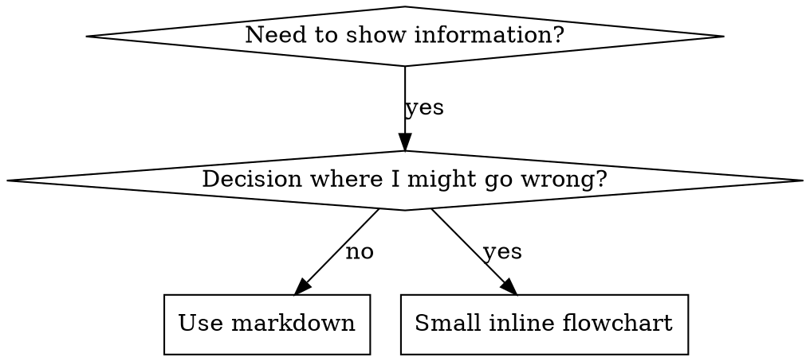

# 编写技能

## 概述

**编写技能就是将测试驱动开发（Test-Driven Development）应用于流程文档。**

**个人技能存放在agent特定目录中（Claude Code 为 `~/.claude/skills`，Codex 为 `~/.agents/skills/`）**

你编写测试用例（带subagent的压力场景），观察它们失败（基线行为），编写技能（文档），观察测试通过（agent遵守），然后重构（封堵漏洞）。

**核心原则：** 如果你没有观察到agent在没有技能的情况下失败，你就不知道技能是否教了正确的东西。

**REQUIRED BACKGROUND:** 你必须在使用本技能之前理解 superpowers:test-driven-development。那个技能定义了基本的红-绿-重构（RED-GREEN-REFACTOR）循环。本技能将 TDD 适配到文档。

**官方指导：** 有关 Anthropic 官方的技能编写最佳实践，参见 anthropic-best-practices.md。该文档提供了额外的模式和指南，与本技能中 TDD 为核心的方法互补。

## 什么是技能？

**技能**是一份关于经过验证的技术、模式或工具的参考指南。技能帮助未来的 Claude 实例发现和应用有效的方法。

**技能是：** 可复用的技术、模式、工具、参考指南

**技能不是：** 关于你曾经如何解决某个问题的叙述

## 技能的 TDD 映射

| TDD 概念 | 技能创建 |
|-------------|----------------|
| **测试用例** | 带subagent的压力场景 |
| **产品代码** | 技能文档（SKILL.md） |
| **测试失败（RED）** | agent在没有技能的情况下违反规则（基线） |
| **测试通过（GREEN）** | agent在有技能的情况下遵守规则 |
| **重构** | 封堵漏洞同时保持合规 |
| **先写测试** | 在编写技能之前运行基线场景 |
| **观察它失败** | 记录agent使用的精确合理化借口 |
| **最少代码** | 编写针对这些具体违反行为的技能 |
| **观察它通过** | 验证agent现在遵守 |
| **重构循环** | 发现新的合理化借口 → 封堵 → 重新验证 |

整个技能创建过程遵循红-绿-重构。

## 何时创建技能

**在以下情况下创建：**
- 技术对你来说不是直觉上明显的
- 你会跨项目再次引用这个
- 模式广泛适用（不是项目特定的）
- 其他人会受益

**不要为以下情况创建：**
- 一次性解决方案
- 在其他地方已经有完善文档的标准实践
- 项目特定的约定（放入 CLAUDE.md）
- 机械约束（如果可以用正则/验证强制执行，自动化它 —— 将文档保留给判断调用）

## 技能类型

### 技巧（Technique）
具有可遵循步骤的具体方法（condition-based-waiting, root-cause-tracing）

### 模式（Pattern）
关于问题的思考方式（flatten-with-flags, test-invariants）

### 参考（Reference）
API 文档、语法指南、工具文档（office docs）

## 目录结构

```
skills/
  skill-name/
    SKILL.md              # 主要参考（必需）
    supporting-file.*     # 仅在需要时
```

**扁平命名空间** —— 所有技能在一个可搜索的命名空间中

**分离文件用于：**
1. **大型参考**（100+ 行）—— API 文档、综合语法
2. **可复用工具** —— 脚本、工具、模板

**保持内联：**
- 原则和概念
- 代码模式（< 50 行）
- 其他所有内容

## SKILL.md 结构

**Frontmatter（YAML）：**
- 两个必需字段：`name` 和 `description`（所有支持的字段参见 [agentskills.io/specification](https://agentskills.io/specification)）
- 总共最多 1024 个字符
- `name`：仅使用字母、数字和连字符（无括号、特殊字符）
- `description`：第三人称，仅描述何时使用（不是它做什么）
  - 以 "Use when..." 开头，聚焦于触发条件
  - 包括具体的症状、情况和上下文
  - **永远不要总结技能的流程或工作流**（原因参见 CSO 部分）
  - 尽可能保持在 500 个字符以内

```markdown
---
name: Skill-Name-With-Hyphens
description: Use when [specific triggering conditions and symptoms]
---

# Skill Name

## Overview
What is this? Core principle in 1-2 sentences.

## When to Use
[Small inline flowchart IF decision non-obvious]

Bullet list with SYMPTOMS and use cases
When NOT to use

## Core Pattern (for techniques/patterns)
Before/after code comparison

## Quick Reference
Table or bullets for scanning common operations

## Implementation
Inline code for simple patterns
Link to file for heavy reference or reusable tools

## Common Mistakes
What goes wrong + fixes

## Real-World Impact (optional)
Concrete results
```

## Claude 搜索优化（CSO）

**对发现至关重要：** 未来的 Claude 需要找到你的技能

### 1. 丰富的描述字段

**目的：** Claude 读取 description 来决定为给定任务加载哪些技能。让它回答："我现在应该读这个技能吗？"

**格式：** 以 "Use when..." 开头，聚焦于触发条件

**关键：Description = 何时使用，而不是技能做什么**

description 应该只描述触发条件。不要在 description 中总结技能的过程或工作流。

**为什么这很重要：** 测试揭示，当 description 总结技能的工作流时，Claude 可能会遵循 description 而不是阅读完整的技能内容。一个 description 写着 "code review between tasks" 导致 Claude 只做了一次审查，即使技能的流程图清楚地显示了两阶段审查（规范合规然后是代码质量）。

当 description 被改为只是 "Use when executing implementation plans with independent tasks"（没有工作流总结），Claude 正确地阅读了流程图并遵循了两阶段审查流程。

**陷阱：** 总结工作流的 description 创建了 Claude 会走的捷径。技能正文变成了 Claude 跳过的文档。

```yaml
# ❌ 不好：总结工作流 —— Claude 可能会遵循这个而不是阅读技能
description: Use when executing plans - dispatches subagent per task with code review between tasks

# ❌ 不好：太多流程细节
description: Use for TDD - write test first, watch it fail, write minimal code, refactor

# ✅ 好：只有触发条件，没有工作流总结
description: Use when executing implementation plans with independent tasks in the current session

# ✅ 好：只有触发条件
description: Use when implementing any feature or bugfix, before writing implementation code
```

**内容：**
- 使用具体的触发器、症状和表明此技能适用的情况
- 描述*问题*（race condition、不一致行为）而不是*语言特定的症状*（setTimeout、sleep）
- 保持触发器技术无关，除非技能本身是技术特定的
- 如果技能是技术特定的，在触发器中明确说明
- 用第三人称写（被注入到系统提示中）
- **永远不要总结技能的流程或工作流**

```yaml
# ❌ 不好：太抽象、模糊，不包括何时使用
description: For async testing

# ❌ 不好：第一人称
description: I can help you with async tests when they're flaky

# ❌ 不好：提到技术但技能不特定于它
description: Use when tests use setTimeout/sleep and are flaky

# ✅ 好：以 "Use when" 开头，描述问题，没有工作流
description: Use when tests have race conditions, timing dependencies, or pass/fail inconsistently

# ✅ 好：技术特定技能，带有明确的触发器
description: Use when using React Router and handling authentication redirects
```

### 2. 关键词覆盖

使用 Claude 会搜索的词：
- 错误消息："Hook timed out"、"ENOTEMPTY"、"race condition"
- 症状："flaky"、"hanging"、"zombie"、"pollution"
- 同义词："timeout/hang/freeze"、"cleanup/teardown/afterEach"
- 工具：实际命令、库名、文件类型

### 3. 描述性命名

**使用主动语态，动词优先：**
- ✅ `creating-skills` 而不是 `skill-creation`
- ✅ `condition-based-waiting` 而不是 `async-test-helpers`

### 4. Token 效率（至关重要）

**问题：** getting-started 和经常引用的技能加载到每个对话中。每个令牌都很重要。

**目标字数：**
- getting-started 工作流：每个 <150 词
- 频繁加载的技能：总共 <200 词
- 其他技能：<500 词（仍然要简洁）

**技巧：**

**将细节移到工具帮助中：**
```bash
# ❌ 不好：在 SKILL.md 中记录所有标志
search-conversations supports --text, --both, --after DATE, --before DATE, --limit N

# ✅ 好：引用 --help
search-conversations supports multiple modes and filters. Run --help for details.
```

**使用交叉引用：**
```markdown
# ❌ 不好：重复工作流细节
When searching, dispatch subagent with template...
[20 lines of repeated instructions]

# ✅ 好：引用其他技能
Always use subagents (50-100x context savings). REQUIRED: Use [other-skill-name] for workflow.
```

**压缩示例：**
```markdown
# ❌ 不好：冗长示例（42 词）
你的人类伙伴 (your human partner): "How did we handle authentication errors in React Router before?"
You: I'll search past conversations for React Router authentication patterns.
[Dispatch subagent with search query: "React Router authentication error handling 401"]

# ✅ 好：最简示例（20 词）
Partner: "How did we handle auth errors in React Router?"
You: Searching...
[Dispatch subagent → synthesis]
```

**消除冗余：**
- 不要重复交叉引用技能中的内容
- 不要解释从命令中已经显而易见的内容
- 不要包含同一模式的多个示例

**验证：**
```bash
wc -w skills/path/SKILL.md
# getting-started 工作流：每个目标 <150
# 其他频繁加载的：总共目标 <200
```

**按你做什么或核心见解命名：**
- ✅ `condition-based-waiting` > `async-test-helpers`
- ✅ `using-skills` 而不是 `skill-usage`
- ✅ `flatten-with-flags` > `data-structure-refactoring`
- ✅ `root-cause-tracing` > `debugging-techniques`

**动名词（-ing）对流程很适用：**
- `creating-skills`、`testing-skills`、`debugging-with-logs`
- 主动，描述你正在采取的行动

### 4. 交叉引用其他技能

**在编写引用其他技能的文档时：**

仅使用技能名称，带有明确的需求标记：
- ✅ 好：`**REQUIRED SUB-SKILL:** Use superpowers:test-driven-development`
- ✅ 好：`**REQUIRED BACKGROUND:** You MUST understand superpowers:systematic-debugging`
- ❌ 不好：`See skills/testing/test-driven-development`（要求不明确）
- ❌ 不好：`@skills/testing/test-driven-development/SKILL.md`（强制加载，消耗上下文）

**为什么不使用 @ 链接：** `@` 语法立即强制加载文件，在你需要它们之前就消耗了 200k+ 上下文。

## 流程图使用



**仅将流程图用于：**
- 非显而易见的决策点
- 你可能过早停止的流程循环
- "何时使用 A vs B" 的决策

**永远不要将流程图用于：**
- 参考材料 → 表格、列表
- 代码示例 → Markdown 块
- 线性指令 → 编号列表
- 没有语义含义的标签（step1、helper2）

参见 @graphviz-conventions.dot 了解 graphviz 样式规则。

**为你的人类伙伴可视化：** 使用此目录中的 `render-graphs.js` 将技能的流程图渲染为 SVG：
```bash
./render-graphs.js ../some-skill           # 每个图单独分开
./render-graphs.js ../some-skill --combine # 所有图在一个 SVG 中
```

## 代码示例

**一个优秀的示例胜过许多平庸的示例**

选择最相关的语言：
- 测试技术 → TypeScript/JavaScript
- 系统调试 → Shell/Python
- 数据处理 → Python

**好的示例：**
- 完整且可运行
- 有良好的注释解释为什么
- 来自真实场景
- 清楚地展示模式
- 可以适配（不是通用模板）

**不要：**
- 用 5+ 种语言实现
- 创建填空模板
- 写虚构的示例

你擅长移植 —— 一个出色的示例就足够了。

## 文件组织

### 自包含技能
```
defense-in-depth/
  SKILL.md    # 所有内容内联
```
当：所有内容适合，不需要大型参考时

### 带有可复用工具的技能
```
condition-based-waiting/
  SKILL.md    # 概述 + 模式
  example.ts  # 可适配的工作辅助代码
```
当：工具是可复用的代码，不仅仅是叙述

### 带有大型参考的技能
```
pptx/
  SKILL.md       # 概述 + 工作流
  pptxgenjs.md   # 600 行 API 参考
  ooxml.md       # 500 行 XML 结构
  scripts/       # 可执行工具
```
当：参考材料太大无法内联时

## 铁律（与 TDD 相同）

```
没有先失败的测试，就没有 skill
```

这适用于新技能和对现有技能的编辑。

测试之前写技能？删掉它。重新开始。
未测试就编辑技能？同样的违反。

**没有例外：**
- 不是"简单添加"的理由
- 不是"只是添加一个部分"的理由
- 不是"文档更新"的理由
- 不要将未测试的更改保留为"参考"
- 不要在运行测试时"调整"
- 删除意味着删除

**REQUIRED BACKGROUND:** superpowers:test-driven-development 技能解释了为什么这很重要。同样的原则适用于文档。

## 测试所有技能类型

不同的技能类型需要不同的测试方法：

### 纪律执行技能（规则/要求）

**示例：** TDD、verification-before-completion、designing-before-coding

**测试方式：**
- 学术问题：他们理解规则吗？
- 压力场景：他们在压力下遵守吗？
- 组合多重压力：时间 + 沉没成本 + 疲惫
- 识别合理化借口并添加明确的计数器

**成功标准：** agent在最大压力下遵循规则

### 技巧技能（操作指南）

**示例：** condition-based-waiting、root-cause-tracing、defensive-programming

**测试方式：**
- 应用场景：他们能正确应用技术吗？
- 变体场景：他们处理边缘情况吗？
- 缺失信息测试：指令有空白吗？

**成功标准：** agent成功地将技术应用于新场景

### 模式技能（思维模型）

**示例：** reducing-complexity、信息隐藏概念

**测试方式：**
- 识别场景：他们识别出模式何时适用吗？
- 应用场景：他们能使用思维模型吗？
- 反例：他们知道何时不要应用吗？

**成功标准：** agent正确识别何时/如何应用模式

### 参考技能（文档/API）

**示例：** API 文档、命令参考、库指南

**测试方式：**
- 检索场景：他们能找到正确的信息吗？
- 应用场景：他们能正确使用找到的内容吗？
- 空白测试：常见用例被覆盖了吗？

**成功标准：** agent找到并正确应用参考信息

## 跳过测试的常见合理化借口

| 借口 | 现实 |
|--------|---------|
| "Skill is obviously clear" | 对你清楚 ≠ 对其他agent清楚。测试它。 |
| "It's just a reference" | 参考可能有空白、不清晰的部分。测试检索。 |
| "Testing is overkill" | 未测试的技能有问题。始终如此。15 分钟测试节省数小时。 |
| "I'll test if problems emerge" | 问题 = agent不能使用技能。在部署之前测试。 |
| "Too tedious to test" | 测试比在生产环境中调试糟糕的技能更不繁琐。 |
| "I'm confident it's good" | 过度自信保证有问题。依然要测试。 |
| "Academic review is enough" | 阅读 ≠ 使用。测试应用场景。 |
| "No time to test" | 部署未测试的技能会浪费更多时间在之后修复它。 |

**所有这些都意味着：部署之前测试。没有例外。**

## 防合理化（Bulletproofing）技能

执行纪律的技能（如 TDD）需要抵抗合理化。agent很聪明，在压力下会找到漏洞。

**心理学笔记：** 理解为什么说服技术有效能帮助你有系统性地应用它们。关于权威（authority）、承诺（commitment）、稀缺（scarcity）、社会认同（social proof）和统一（unity）原则的研究基础参见 persuasion-principles.md（Cialdini, 2021; Meincke et al., 2025）。

### 显式关闭每个漏洞

不要只是陈述规则 —— 禁止具体的workaround：

<Bad>
```markdown
Write code before test? Delete it.
```
</Bad>

<Good>
```markdown
Write code before test? Delete it. Start over.

**No exceptions:**
- Don't keep it as "reference"
- Don't "adapt" it while writing tests
- Don't look at it
- Delete means delete
```
</Good>

### 处理"精神 vs 文字"的论点

及早添加基本原则：

```markdown
**Violating the letter of the rules is violating the spirit of the rules.**
```

这切断了整类"我在遵循精神"的合理化借口。

### 建立合理化表格

从基线测试中捕获合理化借口（参见下面的测试部分）。agent制造的每个借口都放入表格：

```markdown
| Excuse | Reality |
|--------|---------|
| "Too simple to test" | Simple code breaks. Test takes 30 seconds. |
| "I'll test after" | Tests passing immediately prove nothing. |
| "Tests after achieve same goals" | Tests-after = "what does this do?" Tests-first = "what should this do?" |
```

### 创建 Red Flags 列表

让agent在合理化时容易自我检查：

```markdown
## Red Flags - STOP and Start Over

- Code before test
- "I already manually tested it"
- "Tests after achieve the same purpose"
- "It's about spirit not ritual"
- "This is different because..."

**All of these mean: Delete code. Start over with TDD.**
```

### 为违反症状更新 CSO

添加到 description：你即将违反规则的症状：

```yaml
description: use when implementing any feature or bugfix, before writing implementation code
```

## 技能的红-绿-重构

遵循 TDD 循环：

### RED：编写失败的测试（基线）

在没有技能的情况下用subagent运行压力场景。记录准确的行为：
- 他们做了什么选择？
- 他们使用了什么合理化借口（原话）？
- 哪些压力触发了违反？

这是"观察测试失败" —— 你在编写技能之前必须看到agent自然地做什么。

### GREEN：编写最小技能

编写针对这些具体合理化借口的技能。不要为假设情况添加额外内容。

在带有技能的情况下运行相同的场景。agent现在应该遵守。

### REFACTOR：封堵漏洞

agent找到了新的合理化借口？添加明确的计数器。重新测试直到防弹。

**测试方法：** 完整的测试方法参见 @testing-skills-with-subagents.md：
- 如何编写压力场景
- 压力类型（时间、沉没成本、权威、疲惫）
- 有系统地封堵漏洞
- 元测试技术

## 反模式（Anti-Patterns）

### ❌ 叙述性示例
"In session 2025-10-03, we found empty projectDir caused..."
**为什么不好：** 太具体，不可复用

### ❌ 多语言稀释
example-js.js、example-py.py、example-go.go
**为什么不好：** 质量平庸，维护负担

### ❌ 流程图中的代码
```dot
step1 [label="import fs"];
step2 [label="read file"];
```
**为什么不好：** 无法复制粘贴，难以阅读

### ❌ 通用标签
helper1、helper2、step3、pattern4
**为什么不好：** 标签应该有语义含义

## STOP：在转到下一个技能之前

**在编写任何技能之后，你必须停止并完成部署过程。**

**不要：**
- 批量创建多个技能而不测试每一个
- 在当前技能被验证之前转到下一个技能
- 因为"批量更高效"而跳过测试

**下面的部署检查清单对每个技能都是强制性的。**

部署未测试的技能 = 部署未测试的代码。这是违反质量标准。

## 技能创建检查清单（TDD 适配）

**重要：** 使用 TodoWrite 为下面的每个检查清单项创建待办事项。

**RED 阶段 —— 编写失败的测试：**
- [ ] 创建压力场景（纪律技能需要 3+ 组合压力）
- [ ] 在没有技能的情况下运行场景 —— 原话记录基线行为
- [ ] 识别合理化借口/失败的模式

**GREEN 阶段 —— 编写最小技能：**
- [ ] 名称仅使用字母、数字、连字符（无括号/特殊字符）
- [ ] YAML frontmatter 带有必需的 `name` 和 `description` 字段（最多 1024 字符；参见 [spec](https://agentskills.io/specification)）
- [ ] Description 以 "Use when..." 开头，包含具体触发器/症状
- [ ] Description 用第三人称写
- [ ] 全文关键词可搜索（错误、症状、工具）
- [ ] 清晰的概述，包含核心原则
- [ ] 解决在 RED 阶段识别的具体基线失败
- [ ] 代码内联或链接到单独文件
- [ ] 一个优秀示例（不是多语言）
- [ ] 在带有技能的情况下运行场景 —— 验证agent现在遵守

**REFACTOR 阶段 —— 封堵漏洞：**
- [ ] 从测试中识别新的合理化借口
- [ ] 添加显式计数器（如果是纪律技能）
- [ ] 从所有测试迭代建立合理化表格
- [ ] 创建 Red Flags 列表
- [ ] 重新测试直到防弹

**质量检查：**
- [ ] 仅在决策非显而易见时使用小流程图
- [ ] 快速参考表
- [ ] 常见错误部分
- [ ] 没有叙事性故事
- [ ] 辅助文件仅用于工具或大型参考

**部署：**
- [ ] 提交技能到 git 并推送到你的 fork（如果已配置）
- [ ] 考虑通过 PR 回馈（如果广泛有用）

## 发现工作流

未来的 Claude 如何找到你的技能：

1. **遇到问题**（"tests are flaky"）
3. **找到技能**（description 匹配）
4. **扫描概述**（这相关吗？）
5. **阅读模式**（快速参考表）
6. **加载示例**（仅在实现时）

**针对这个流程优化** —— 尽早且频繁地放置可搜索的术语。

## 底线

**创建技能就是流程文档的 TDD。**

同样的铁律：没有失败的测试就没有技能。
同样的循环：RED（基线）→ GREEN（编写技能）→ REFACTOR（封堵漏洞）。
同样的好处：更好的质量，更少的意外，防弹的结果。

如果你在代码中遵循 TDD，在技能中也遵循它。这是应用于文档的相同纪律。
